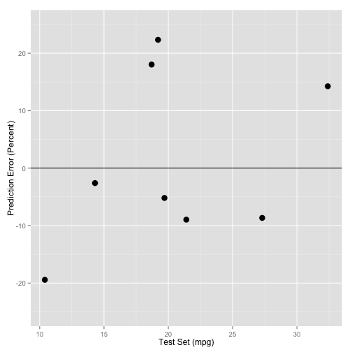

Predicting Fuel Efficiency
========================================================
author: Sasmito Adibowo
date: 17 March 2015


Background
========================================================
Why Predict?

 - New model every year - expensive to re-test
 - Inform consumers, car designers, and regulators

How to predict?
 - Use machine learning techniques
 - Reference data from 1974 _Motor Trend_ US magazine
 


Prediction Model
========================================================

Estimate fuel efficiency from engine classifications and a quick performance test.


```r
set.seed(42)
indexTraining <- createDataPartition(
    inputData$mpg, p=0.7, list=TRUE)$Resample1
trainingSet <- inputData[indexTraining,] 

modFit <- train(form =
    mpg ~ cyl + disp + hp + drat + wt + qsec + vs + am + gear + carb,
    method="rf", trControl = trainControl( method="cv"), data=trainingSet)
```

We also have a **[web-based calculator](http://adib.shinyapps.io/devdataprod-012_01)** to try out the model.


Prediction Accuracy
========================================================
left: 70%

 

***


Estimated accuracy based on reference data:

# 88%


Future Works
========================================================

 - More research needed
    - Prototype calculator based on car models from 1973 - 1974
    - Gauge usefullness of model
    - Evaluate relevance to data available for recent cars
    - Create model for TCO and not just MPG
 - Potential applications
    - B2B: help car makers design more fuel efficient cars.
    - B2G: help governments estimate carbon tax required for a given car model
    - B2C: help consumers make an informed buying decision
 - Funding please
 
